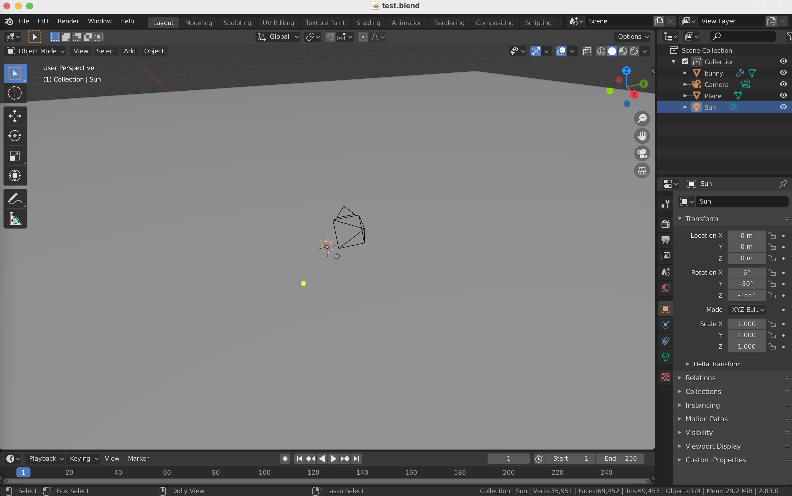
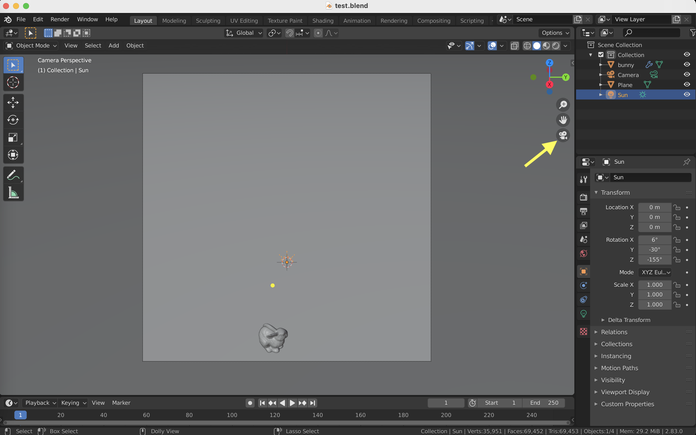
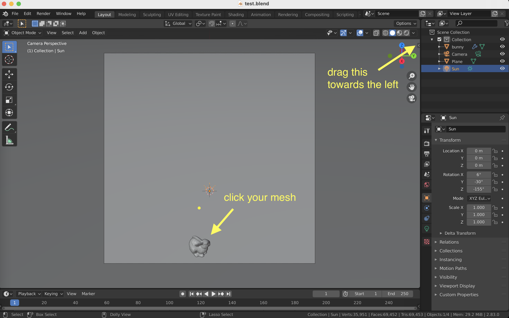
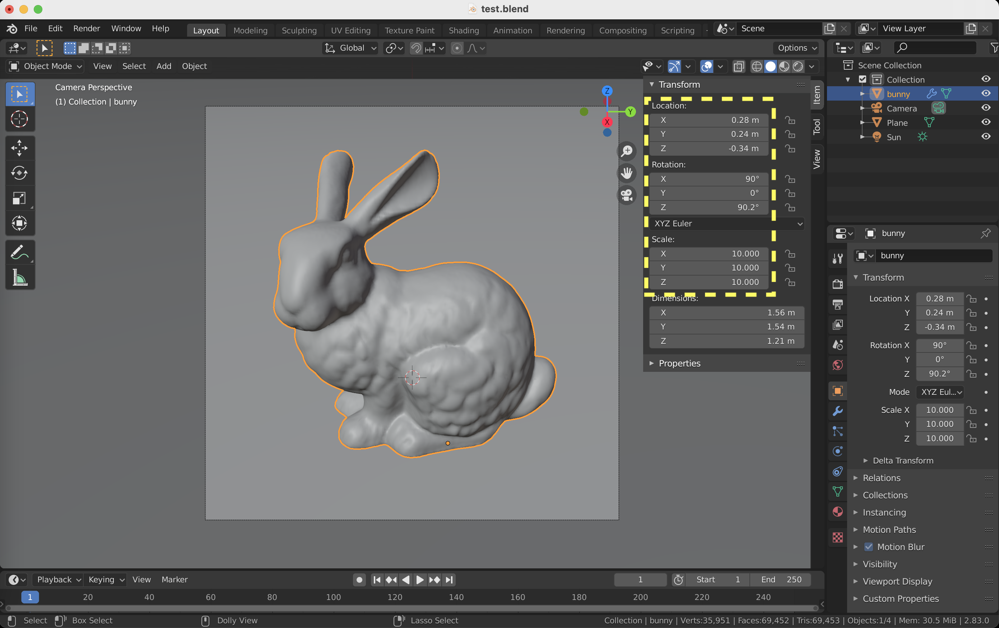
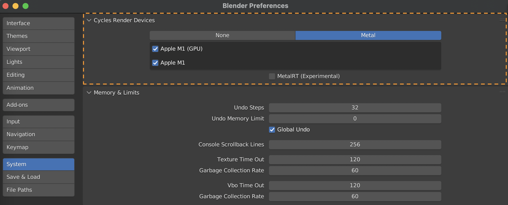

# **NEW!!** Installation with pip
To use this toolbox, please make sure to install [Blender](https://www.blender.org) (version 4.3.0) and then install the toolbox with the following commands
```
conda create -n blender python=3.11
source activate blender
pip install bpy==4.3.0 --extra-index-url https://download.blender.org/pypi/
pip install blendertoolbox
```
Please make sure you're using python 3.10, as Blender Python `bpy` is only compiled for that version of python.

Once it is installed successfully, one can simply type in, e.g.,
```
python template.py
```
to render the mesh.

If for some reasons, `pip` has difficulty installing the packages. One can still fall back to the old way: downloading the toolbox and import the module `blendertoolbox` manually. This will require some changes to the demo scripts. After the modifications, you would need to call the script with blender background mode as
```
blender -b -P template.py
```

(We especially want to thank [Otman Benchekroun](https://otman.ca/) for making the pip integration possible!)
<!-- 
# Blender Toolbox

This is a set of Python scripts for rendering 3D shapes in [Blender](https://www.blender.org). These scripts are just from my personal codebase for rendering paper-worthy figures. To use them, make sure you have installed Blender and you can run the demo by typing 
```
blender --background --python template.py
```
You may need to create an alias if you cannot run `blender` from the terminal.  

This toolbox contains a set of standalone demos in `./demos/` to demonstrate different rendering effects. You can browse the results of the demos in `./demos/*.png`. You can also find some documented template demos in the main folder `./`:
- The `template.py` is a customizable template script for users to plug-and-play different materials and parameters from the examples in `./demos`.
- The `template_pointCloud.py` is a demo for rendering point clouds as tiny spheres. 
- The `template_lazy.py` is the minimum version for you to render a mesh with the default camera, lighting, material. If you just want a quick rendering pipeline to visualize your triangle meshes, you can follow the lazy pipeline section below to see how easy it is to use `template_lazy.py`. -->

## Lazy Pipeline

This is the step-by-step tutorial on how to use the `default_mesh.py` to render a mesh in few minutes.

First, in `default_mesh.py`, you can set `mesh_path` to the desired mesh path you would like to render
```
"mesh_path": "path/to/your/mesh.obj"
```
Now go to your terminal, and then run the script using
```
python default_mesh.py
```
This will execute the script and you will see the progress of rendering like
```
...
Fra:1 Mem:57.95M (0.00M, Peak 58.09M) | Time:00:02.00 | Remaining:00:08.06 | Mem:23.22M, Peak:23.22M | Scene, View Layer | Rendered 1/64 Tiles, Denoised 0 tiles
Fra:1 Mem:58.45M (0.00M, Peak 58.65M) | Time:00:02.69 | Remaining:00:09.32 | Mem:23.72M, Peak:23.72M | Scene, View Layer | Rendered 2/64 Tiles, Denoised 0 tiles
...
```
Once you see those messages, you can manually terminate the program (e.g., `Ctrl + C` on Mac). The purpose of running this is to create a `test.blend` file so that we can adjust the mesh position in the Blender UI. 
So now open the newly created `test.blend` file using Blender software. You should land on the default scene like this

The next step is to click this "camera bottom" (yellow arrow) to view the scene from the eye of the camera

The next step is to click the mesh in the scene and drag the tiny arrow towards the left

You should see a new window that displays the mesh information (position, rotation, scale). The final step is to adjust all these parameters to your liking

Then you can copy those adjusted parameters from the Blender UI back to `mesh_position`, `mesh_rotation`, `mesh_scale` in the script respectively. The above steps are all you need in order to render a mesh, you can now re-run the script in the terminal
```
python default_mesh.py
```
This will output a `.png` file as your final rendering result. 

We also expose other commonly adjusted parameters, such as lighting angle, mesh color, image resolution, etc. For more details, please read the comments in the `default_mesh.py`.

The sample rendering pipeline works for all the demo files in the repository. Other "non-lazy" demos expose more parameters for users to tune. However, in order to know how to adjust those parameters require some background knowledge in Blender. I refer users to a quick introduction to Blender UI from Silvia's [website](https://www.silviasellan.com/blender_figure.html). There are also a ton of online tutorials which off er more advanced stuff way beyond what I have covered here.
<!-- 
## Notes

Before rendering a scene, you probably need to set up the default rendering devices in the user preferences (e.g., which GPU to use). You only need to set up the user preferences once, then the script should be able to detect the GPUs automatically in the future. To set up the rendering devices, open the blender, go to `Edit` > `Preferences` > `System`, then in the `Cycles Render Devices` select your preferred devices for rendering (e.g., select `CUDA` and check every GPUs on your computer). After setting up the devices, click the `Save Preference` on bottom left.


For a more detailed tutorial on Blender rendering with/without scripting, please refer to [link](https://www.silviasellan.com/blender_course_scripting.html) by Silvia Sellán. -->

## Contact

These scripts are tested on Blender 4.3.0. As the API may change, using a different version of the Blender may cause some functions not working properly. If you notice some bugs due to Blender updates or any questions/recommendations, please contact hsuehtil@gmail.com.

## BibTeX
```
@software{Liu_BlenderToolbox_2018,
  author = {Liu, Hsueh-Ti Derek},
  month = {12},
  title = {{Blender Toolbox}},
  url = {https://github.com/HTDerekLiu/BlenderToolbox},
  year = {2018}
}
```
