# Demo Gallery

| 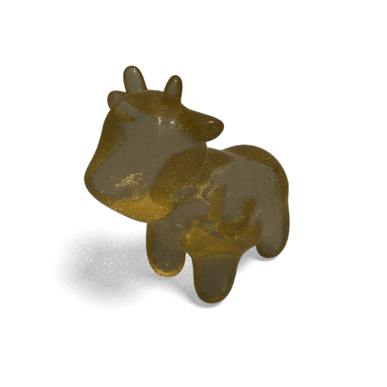 [demo_amber.py](demo_amber.py) |  [demo_ambientOcclusion.py](demo_ambientOcclusion.py) |  [demo_balloon.py](demo_balloon.py) |
| --- | --- | --- |
|  [demo_boundaryLoop.py](demo_boundaryLoop.py) |  [demo_carPaint.py](demo_carPaint.py) | 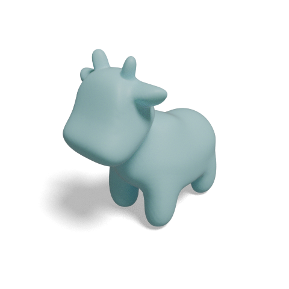 [demo_ceramic.py](demo_ceramic.py) |
| --- | --- | --- |
|  [demo_chrome.py](demo_chrome.py) |  [demo_colorbrewer.py](demo_colorbrewer.py) | 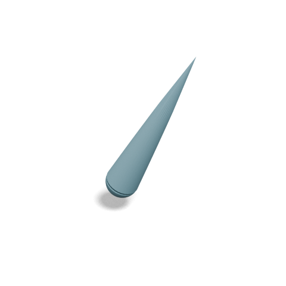 [demo_createArrow.py](demo_createArrow.py) |
| --- | --- | --- |
|  [demo_drawLines.py](demo_drawLines.py) |  [demo_edge.py](demo_edge.py) | 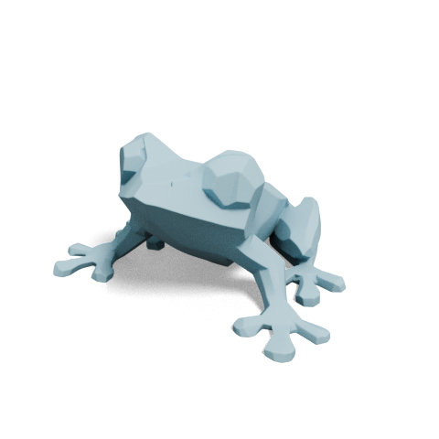 [demo_edgeNormals.py](demo_edgeNormals.py) |
| --- | --- | --- |
| 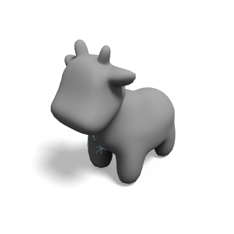 [demo_edgeSubset.py](demo_edgeSubset.py) |  [demo_edgeWithTexture.py](demo_edgeWithTexture.py) |  [demo_emission.py](demo_emission.py) |
| --- | --- | --- |
|  [demo_faceColors.py](demo_faceColors.py) |  [demo_facePoints.py](demo_facePoints.py) |  [demo_faceScalars.py](demo_faceScalars.py) |
| --- | --- | --- |
|  [demo_glass.py](demo_glass.py) | 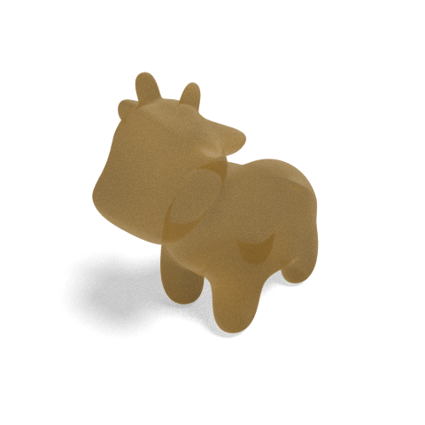 [demo_honey.py](demo_honey.py) |  [demo_isoline.py](demo_isoline.py) |
| --- | --- | --- |
|  [demo_isolineNumpy.py](demo_isolineNumpy.py) |  [demo_metal.py](demo_metal.py) |  [demo_monotone.py](demo_monotone.py) |
| --- | --- | --- |
|  [demo_muscle.py](demo_muscle.py) |  [demo_numpyMesh.py](demo_numpyMesh.py) |  [demo_numpyPointCloud.py](demo_numpyPointCloud.py) |
| --- | --- | --- |
| 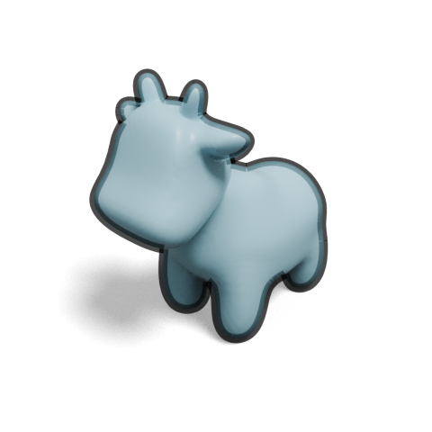 [demo_outline.py](demo_outline.py) |  [demo_plastic.py](demo_plastic.py) |  [demo_pointCloud.py](demo_pointCloud.py) |
| --- | --- | --- |
|  [demo_pointCloudColors.py](demo_pointCloudColors.py) |  [demo_pointCloudScalars.py](demo_pointCloudScalars.py) | 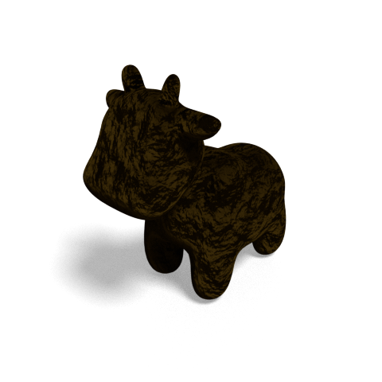 [demo_poop.py](demo_poop.py) |
| --- | --- | --- |
| 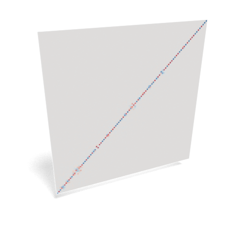 [demo_readImage.py](demo_readImage.py) | 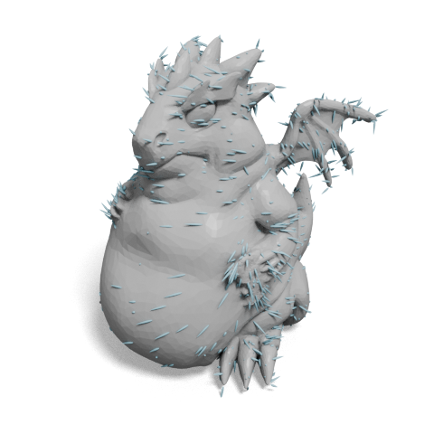 [demo_scaledVectorField.py](demo_scaledVectorField.py) |  [demo_singleColor.py](demo_singleColor.py) |
| --- | --- | --- |
|  [demo_slicePlane.py](demo_slicePlane.py) |  [demo_stone.py](demo_stone.py) |  [demo_texture.py](demo_texture.py) |
| --- | --- | --- |
| 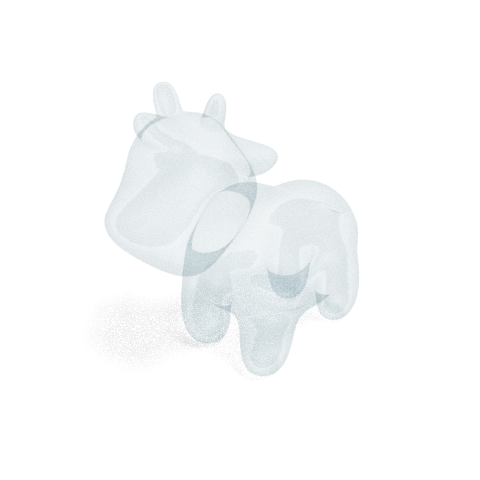 [demo_transparent.py](demo_transparent.py) |  [demo_vertexColors_ply.py](demo_vertexColors_ply.py) |  [demo_vertexColors.py](demo_vertexColors.py) |
| --- | --- | --- |
| 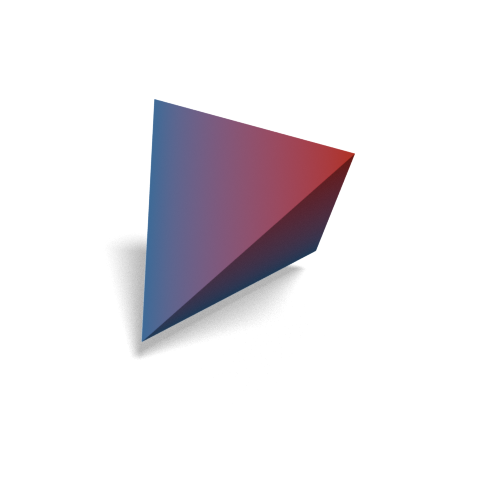 [demo_vertexScalars.py](demo_vertexScalars.py) | 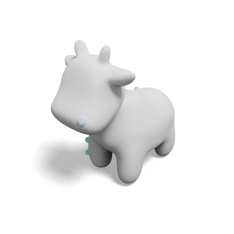 [demo_vertexSubset.py](demo_vertexSubset.py) | |
| --- | --- | --- |
